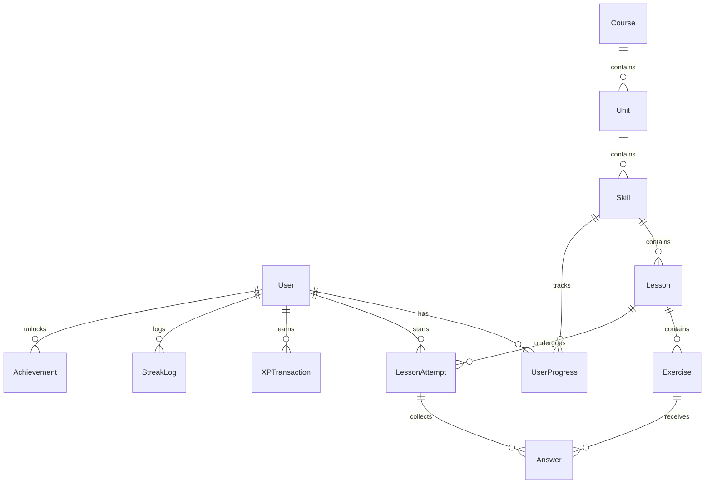

# Duolingo Web App Clone

A full-stack, high-fidelity clone of the Duolingo web application. Built as a full-featured quiz and gamification platform featuring a linear skill progression path, an interactive exercise player with 5 question types, XP ledger logic, automatic heart regeneration, a live leaderboard, and achievements.

---

## 🏗️ Technical Architecture & Folder Structure

The project is split into a **Next.js frontend** and a **FastAPI backend** connected to a **SQLite** database:

```
repo/
├── frontend/                     # Next.js (TypeScript) Web App
│   ├── app/                      # Page components (App Router)
│   ├── components/               # Custom UI & Exercise components
│   ├── lib/                      # Type definitions & API Fetch wrapper
│   └── store/                    # Zustand store for gamification stats
├── backend/                      # FastAPI (Python) Web Server
│   ├── routes/                   # Submodule routers (courses, attempts, profile...)
│   ├── db.py                     # SQLAlchemy connection details
│   ├── models.py                 # SQLAlchemy schemas
│   ├── schemas.py                # Pydantic validation models
│   ├── seed.py                   # Populates DB with exercises & mock users
│   └── main.py                   # API entry point
└── duolingo.db                   # SQLite DB file
```

---

## 🗄️ Database Schema & ER Diagram



### Table Definitions

*   **User**: Stores the player's current stats (`hearts`, `hearts_last_lost_at`, `gems`, `daily_xp_goal`, `username`).
*   **Course**: Language paths (e.g. `Spanish`).
*   **Unit**: Learning chapters (e.g. `Basics & Greetings`, `Travel & Food`).
*   **Skill**: Topics inside chapters (e.g. `Greetings`, `Introduction`, `Café`).
*   **Lesson**: Sequence levels within a skill. Completing lessons increments skill crowns.
*   **Exercise**: Interactive test items storing a `type` and question payload (`data_json`).
*   **UserProgress**: Connects user to skill crown counts and state (`locked`, `available`, `completed`).
*   **LessonAttempt**: Log of started/completed lesson games tracking mistake counts (`hearts_lost`).
*   **Answer**: Log of correctness checks for each question in an attempt.
*   **XPTransaction**: Ledger of XP rewards gained (`source` can be `lesson_complete` or `perfect_lesson_bonus`).
*   **StreakLog**: Daily completion ledger mapping streak dates.
*   **Achievement**: Badges earned (`perfect_lesson`, `first_lesson`, `streak_7`).

---

## 🔌 API Endpoints Table

| Method | Endpoint | Description | Request Body | Response Shape |
| :--- | :--- | :--- | :--- | :--- |
| **GET** | `/courses` | List all language courses | None | `Course[]` |
| **GET** | `/courses/{id}/path` | Fetch full units, skills, & progress tree | None | `CoursePath` |
| **GET** | `/skills/{id}/lessons` | List lessons inside skill with locking states | None | `LessonList[]` |
| **GET** | `/lessons/{id}` | Retrieve lesson exercises payload | None | `Lesson` |
| **POST** | `/lessons/{id}/attempts` | Initiate a new lesson player attempt | None | `StartAttemptResponse` |
| **POST** | `/attempts/{id}/answers` | Save question answer & apply heart loss | `AnswerSubmitRequest` | `AnswerSubmitResponse` |
| **POST** | `/attempts/{id}/complete` | Finish lesson, ledger XP/streaks/badges | None | `CompleteAttemptResponse` |
| **GET** | `/profile` | Retrieve profile stats & badges | None | `ProfileResponse` |
| **PATCH**| `/profile` | Update username or daily XP goal | `ProfileUpdateRequest`| `ProfileResponse` |
| **GET** | `/leaderboard` | Get ranked list of users by total XP | None | `LeaderboardEntry[]` |
| **POST** | `/hearts/refill` | Refill user hearts to 5 (mocked) | None | `RefillHeartsResponse` |

---

## ⚙️ How to Setup & Run

### Prerequisites
*   Node.js (v18+)
*   Python (3.9+)

### 1. Start the Backend
Navigate to the root directory and set up a virtual environment (optional) or install dependencies directly:
```bash
# Install backend requirements
pip install fastapi uvicorn sqlalchemy pydantic

# Seed the database (drops existing and recreates standard exercises & leaderboard users)
python -m backend.seed

# Run the API server
uvicorn backend.main:app --reload --port 8000
```
The API documentation will be available at `http://localhost:8000/docs`.

### 2. Start the Frontend
Navigate to the `frontend` directory and install packages:
```bash
cd frontend

# Install package dependencies
npm install

# Start the Next.js development server
npm run dev
```
Open `http://localhost:3000` in your browser to experience the application.

---

## 🛠️ Architecture Tradeoffs & Mocked Sections

### Tradeoffs
1.  **XP Transaction Ledger**: Instead of storing `total_xp` as an incrementable integer column on the `User` table, we calculate total XP dynamically using the sum of the `XPTransaction` history table. This ledger-based style creates an audit trail of how and when users earned XP (matching professional database design), but scales slightly with list queries.
2.  **Linear Progression Locking**: Lock/unlock status of skill paths is resolved dynamically at runtime by reading sequential skill indexes. The first skill is unlocked by default, and a skill becomes active only if the preceding skill is marked completed.
3.  **Local Answer Verification**: To prevent lag during lessons, correct answers are evaluated client-side for zero-latency feedback (feedback panel slides up instantly). However, the answer is still sent to `/attempts/{id}/answers` for backend evaluation and database persistence.

### Mocked Flows
1.  **Single User Auth**: As per assignment requirements, authentication is omitted. The app assumes you are logged in as default user `user_id = 1` ("learner").
2.  **Heart Regeneration time**: Recovering hearts occurs automatically at a simulated frequency of 1 heart every 5 minutes (300 seconds) so that the recovery system is testable in a demo interview, rather than the real-world 4-hour interval.
3.  **Hearts Refill**: Hearts can be refilled instantly via a mock button in the header or in the Out-of-Hearts popup without requiring real-world gem payment.
